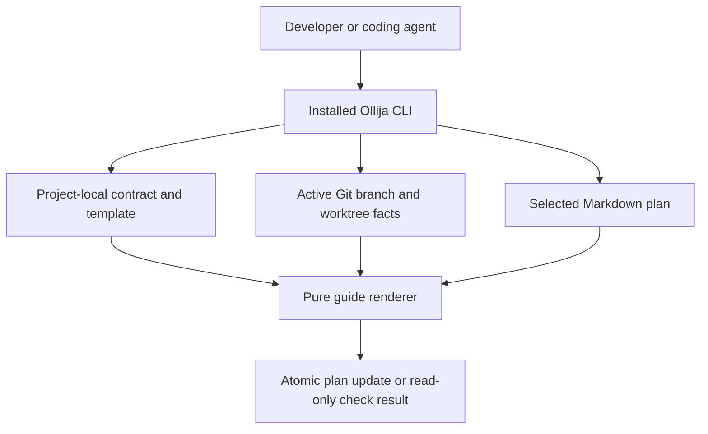
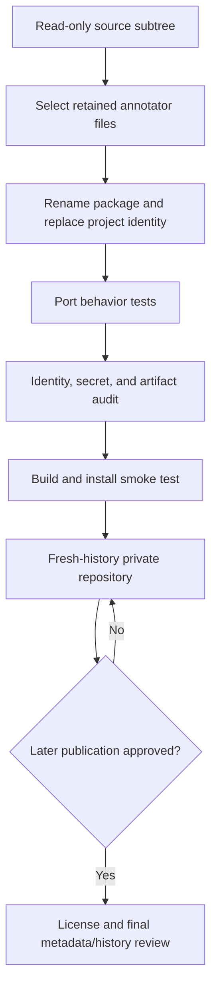

# Standalone Ollija Extraction - Plan

**Target repo:** `ollija`

## Goal Capsule

- **Objective:** Developers and coding agents can install Ollija from its own repository and use the same deterministic plan-guidance behavior in unrelated projects without inheriting private application identity or runtime data.
- **Means:** Extract the current stateless annotator into a conventional Python package, provide neutral consumer assets, and enforce public-readiness checks before any visibility change. (KTD1-KTD4)
- **Authority:** The Product Contract owns user-visible scope. The Planning Contract owns package and extraction mechanics. The source checkout remains read-only.
- **Execution profile:** Code implementation with characterization-first porting, clean-environment package verification, and private GitHub delivery.
- **Stop conditions:** Stop if the source checkout must be mutated, the target name is already occupied under the authenticated GitHub account, or a required retained file cannot be sanitized without changing its documented behavior.
- **Tail ownership:** The LFG shipping tail creates or confirms the private remote, pushes the reviewed branch, opens the pull request, and waits for required checks.

---

## Product Contract

### Summary

Create Ollija as an independent Python CLI repository that preserves its current deterministic plan-annotation contract while removing all source-application identity, runtime evidence, and unrelated host integration.

### Problem Frame

Ollija currently lives inside an application repository even though its surviving behavior is application-independent. Its implementation, tests, agent instructions, configuration, runtime remnants, and historical documents are interleaved with application names, machine names, account names, deployment services, absolute paths, and obsolete release-engine state.

A direct subtree copy would therefore create an installability problem and a disclosure risk. It would also preserve tests and documents for behavior that the current Ollija boundary intentionally retired. The extraction needs a selected, test-backed boundary and fresh repository history.

### Actors

- A1. A developer installs and configures Ollija for a consuming Git repository.
- A2. A coding agent follows the distributed Ollija skill and uses the same project-local plan contract as the developer.
- A3. The GitHub repository and CI service protect the future public source tree from regression.

### Requirements

**Standalone distribution**

- R1. The requested development workspace contains a new Git repository named `ollija`, and the authenticated GitHub account contains a private repository with the same name.
- R2. The standalone CLI preserves the current public `annotate-plan` and `annotate-plan --check` behavior, including deterministic plan selection, generated-guide replacement, atomic writes, branch validation, and linked-worktree handling.
- R3. The distribution installs on supported POSIX systems with Python 3.11 or newer and exposes both the `ollija` command and the `python -m ollija` entry point.

**Sanitized reusable boundary**

- R4. Tracked content contains no source-application name, personal machine or account name, private service name, absolute home path, source commit or pull-request identifier, credential-shaped value, runtime receipt, log, database, cache, or compiled artifact.
- R5. The repository contains neutral example configuration, delivery-guide, hook, and agent-skill assets that a consuming project can copy and customize without editing Ollija's package source.
- R6. The source application checkout and its current working-tree changes remain untouched.

**Regression resistance and delivery**

- R7. Ported tests distinguish retained annotator behavior from excluded application deployment behavior and run without importing the source application.
- R8. Automated checks cover unit behavior, command behavior, package build/install behavior, repository hygiene, and forbidden-identity scanning.
- R9. The remote remains private during this extraction; a future public visibility change requires a separate license decision and a final review of tracked files, Git history, workflow logs, and repository metadata.

### Key Flows

- F1. Configure and annotate a project
  - **Trigger:** A1 or A2 prepares a consuming Git repository.
  - **Steps:** Copy neutral project assets, replace placeholders, install Ollija, run `ollija annotate-plan`, and continue with the exact returned plan path.
  - **Outcome:** The project has one branch-matched plan with a deterministic generated delivery guide.
  - **Covered by:** R2, R3, R5
- F2. Verify a plan without mutation
  - **Trigger:** A parent workflow is ready for a Git or deployment mutation.
  - **Steps:** Run check mode against the selected plan and stop on missing, malformed, cross-branch, or stale guidance.
  - **Outcome:** A zero exit proves the tracked contract, worktree facts, and generated guide agree without changing files.
  - **Covered by:** R2, R7
- F3. Prepare the repository for later publication
  - **Trigger:** The extracted tree is ready to ship to its private remote.
  - **Steps:** Run tests, lint, build/install smoke checks, identity and credential scans, then inspect the fresh history and remote metadata.
  - **Outcome:** The private repository is reviewable without exposing source-project identity and has an explicit gate before a future public transition.
  - **Covered by:** R4, R8, R9

### Acceptance Examples

- AE1. **Covers R2, R3.** Given an installed package and a temporary Git project with neutral Ollija assets, when the user runs `ollija annotate-plan`, then one branch-matched plan is created or refreshed and the command returns structured JSON naming that plan.
- AE2. **Covers R2.** Given a current annotated plan, when the user runs check mode, then the command exits successfully and preserves every file byte.
- AE3. **Covers R4, R8.** Given the tracked tree and complete Git history, when the public-readiness audit runs, then it reports no forbidden identity, private path, source identifier, credential pattern, or tracked runtime artifact.
- AE4. **Covers R5, R7.** Given only the standalone checkout and its declared development dependencies, when the full tests run, then no source-application module, deployment blueprint, or runtime state is required.
- AE5. **Covers R9.** Given the initial GitHub delivery, when repository metadata is inspected, then visibility is private and no package-publishing workflow is enabled.

### Scope Boundaries

**Included**

- The current six-module stateless annotator, its command wrapper, its portable tests, neutral templates, and agent-facing guidance.
- Standalone package metadata, CI, contributor-facing documentation, and public-readiness checks.
- A fresh local and private remote repository with a pull-request review path.

**Excluded**

- Retired release, approval, task-supervision, database-refresh, browser-assessment, deployment, receipt, and persistent-state engines.
- Source-application deployment topology, middleware, database, and staging-access tests.
- Runtime logs, receipts, references, caches, compiled bytecode, backup data, and historical operational reports.
- Changes to the source checkout or integration into a consuming application during this run.

### Deferred to Follow-Up Work

- Choose an open-source license and add the matching package metadata before making the repository public.
- Integrate the packaged CLI and project assets into the first consuming application.
- Define long-term maintenance ownership and the policy for transferring improvements from consuming repositories back into Ollija.
- Decide whether a future initialization command should replace the documented copy-and-customize setup flow.
- Publish a package index release only after distribution naming, ownership, and release automation are approved.

---

## Planning Contract

### Key Technical Decisions

- KTD1. **Treat the current stateless annotator as the extraction boundary.** Repository history shows that the stateful release engine was deliberately deleted; the standalone project must not revive its ignored remnants or superseded documentation. Governs R2, R4, R7.
- KTD2. **Use a `src/ollija` package and a standard console-script entry point.** This removes the host application's `scripts` namespace and makes imports, editable installs, wheels, and clean-environment CLI checks exercise the same package. Governs R3, R7, R8.
- KTD3. **Keep consumer policy in copied project assets and give agents no private execution path.** The Python package interprets the contract, while example configuration, the generated-guide template, the optional Git hook, and agent guidance remain editable artifacts owned by each consuming repository. Developers and agents invoke the same command against the same Git facts, configuration, and plan. Governs R2, R5.
- KTD4. **Enforce public readiness as code.** CI runs behavior, lint, build/install, tracked-artifact, credential-shape, and forbidden-identity checks. Third-party workflow actions use immutable commit pins, and the workflow receives read-only repository permissions. The remote stays private until licensing and public metadata are reviewed. Governs R4, R8, R9.

### Assumptions

- A fresh Git history is preferred over filtered source history so deleted private material and obsolete commits cannot be recovered from the new repository.
- The private GitHub repository should be created under the account authenticated in the local GitHub CLI because no separate organization was named.
- The repository should omit author metadata, project URLs, and a license during this extraction; these are publication decisions rather than requirements for private review.
- POSIX support is sufficient for the first standalone release because the retained implementation depends on `fcntl`, shell hooks, and Git worktrees.
- The source checkout's currently tracked Ollija files are authoritative even though ignored bytecode from the retired engine causes one source hygiene test to fail locally.
- Fresh commits use a neutral repository-local author name and non-routable email so personal identity is not copied into the new history; remote account ownership remains unavoidable GitHub metadata.

### High-Level Technical Design

The installed command and module entry point converge on one package. Project-specific facts remain in the consuming repository.



The extraction admits only the current reusable boundary and proves the resulting distribution before it reaches GitHub.



### Output Structure

```text
.
├── .github/
│   └── workflows/
│       └── ci.yml
├── docs/
│   └── plans/
│       └── 2026-09-04-0911-feat-standalone-ollija-extraction-plan.md
├── examples/
│   └── project/
│       ├── .ollija/
│       │   ├── hooks/post-checkout
│       │   ├── project.yaml
│       │   └── templates/delivery-guide.md
│       └── agent-skills/ollija/
│           ├── SKILL.md
│           └── agents/openai.yaml
├── src/
│   └── ollija/
│       ├── __init__.py
│       ├── __main__.py
│       ├── annotate_plan.py
│       ├── cli.py
│       ├── config.py
│       └── worktrees.py
├── tests/
│   ├── conftest.py
│   ├── test_agent_assets.py
│   ├── test_annotate_plan.py
│   ├── test_cli.py
│   ├── test_config.py
│   ├── test_plan_discovery.py
│   ├── test_repository_hygiene.py
│   └── test_worktrees.py
├── .gitignore
├── CHANGELOG.md
├── README.md
└── pyproject.toml
```

### Sequencing

1. Establish fresh repository history and package metadata without importing source history.
2. Port retained behavior with characterization coverage before changing package names or command paths.
3. Generalize examples, documentation, and agent assets after the package contract is stable.
4. Add publication-safety and clean-install gates before creating the remote repository and pull request.

### System-Wide Impact

- **CLI contract:** `annotate-plan`, its flags, JSON results, exit behavior, and stable error tokens are public integration surfaces. Namespace migration must not silently rename them.
- **Configuration contract:** Schema version 1 remains the compatibility boundary. Consumer-specific values stay in `.ollija/project.yaml`; package code and examples contain no real deployment identity.
- **Shared agent workspace:** Developers and agents read and mutate the same Markdown plan. The distributed skill documents the CLI contract but cannot bypass validation, acquire release authority, or invoke a hidden agent-only workflow.
- **Filesystem safety:** Plan creation uses exclusive creation under a Git lock. Existing plan updates remain durable atomic replacements, and check mode remains read-only.
- **External side effects:** Ollija itself performs no commit, push, deployment, package publication, or GitHub mutation. The parent workflow owns those operations and must read the plan result first.
- **Persistent data:** The standalone project introduces no database, receipt store, supervisor state, or background process. Project-local generated plan content is the only durable output.

---

## Implementation Units

### U1. Establish the standalone package skeleton

- **Goal:** Create a minimal Python distribution and fresh repository boundary for the retained CLI.
- **Requirements:** R1, R3, R6
- **Dependencies:** None
- **Files:** `pyproject.toml`, `.gitignore`, `README.md`, `src/ollija/__init__.py`, `src/ollija/__main__.py`, `tests/conftest.py`
- **Approach:**
  1. Initialize fresh history with a neutral default branch and no imported commits.
  2. Declare only the runtime dependency used by the annotator and a bounded development extra for tests, lint, and builds.
  3. Expose `ollija` through standard package metadata and keep module execution equivalent.
  4. Declare POSIX support in package metadata and the README, including the retained `fcntl`, shell-hook, and Git-worktree constraints; do not advertise Windows support.
  5. Ignore virtual environments, build output, caches, compiled files, local worktrees, and any `.ollija/state` tree.
- **Execution note:** This unit is packaging-heavy; prove the skeleton with an editable-install and command-help smoke check.
- **Patterns to follow:** PyPA `pyproject.toml` metadata and console-script conventions.
- **Test scenarios:**
  - Installing the project in an isolated environment exposes an `ollija` executable that returns help without importing the source checkout.
  - Running `python -m ollija --help` exposes the same sole public command.
  - Building both wheel and source distribution includes the six package modules and excludes tests, caches, state, and source-repository artifacts.
- **Verification:** A clean environment can build, install, import, and invoke the distribution using only declared dependencies.

### U2. Port the deterministic annotator with characterization coverage

- **Goal:** Move the current reusable implementation into the standalone namespace without changing its observable plan behavior.
- **Requirements:** R2, R3, R7
- **Dependencies:** U1
- **Files:** `src/ollija/annotate_plan.py`, `src/ollija/cli.py`, `src/ollija/config.py`, `src/ollija/worktrees.py`, `tests/test_annotate_plan.py`, `tests/test_cli.py`, `tests/test_config.py`, `tests/test_plan_discovery.py`, `tests/test_worktrees.py`, `tests/conftest.py`
- **Approach:**
  1. Port only the current tracked modules and replace host namespace imports with package-relative imports.
  2. Move repeated temporary-repository and project-contract setup into neutral test helpers.
  3. Preserve safe YAML loading, byte-safe parsing, exclusive stub creation, file locking, durable atomic replacement, branch matching, and linked-worktree facts per KTD1.
  4. Replace application, account, service, and machine fixtures with reserved example domains and temporary paths.
- **Execution note:** Port the behavior tests before renaming imports so any semantic drift is visible as a characterization failure.
- **Patterns to follow:** Existing pure rendering boundary in `src/ollija/annotate_plan.py` and structured JSON command results in `src/ollija/cli.py`.
- **Test scenarios:**
  - Covers AE1. A named branch with no plan creates one unique annotated stub and returns its path in JSON.
  - Covers AE2. A current plan passes check mode with byte-for-byte identical content and directory entries, while stale, malformed, missing, ambiguous, and cross-branch plans fail without changing existing bytes.
  - Re-annotation replaces exactly one generated marker span and preserves human content and delivery exceptions byte-for-byte.
  - A project contract containing a Python-specific YAML object tag is rejected without constructing or executing the tagged object.
  - Concurrent plan creation converges through the Git lock or returns the documented nonblocking hook error without duplicate plans.
  - Primary, detached, canonical linked, noncanonical linked, and unsafe branch-path worktrees produce the current expected placement behavior.
- **Verification:** All retained source tests pass from their new paths, and no test imports or opens a file outside the standalone checkout except its own temporary directories.

### U3. Provide neutral consumer and agent assets

- **Goal:** Make the standalone tool adoptable by another repository without copying private application policy.
- **Requirements:** R4, R5, R7
- **Dependencies:** U2
- **Files:** `examples/project/.ollija/project.yaml`, `examples/project/.ollija/templates/delivery-guide.md`, `examples/project/.ollija/hooks/post-checkout`, `examples/project/agent-skills/ollija/SKILL.md`, `examples/project/agent-skills/ollija/agents/openai.yaml`, `tests/test_agent_assets.py`, `README.md`, `CHANGELOG.md`
- **Approach:**
  1. Rewrite the delivery guide and skill around the installed `ollija` command and neutral placeholders.
  2. Keep every Git-derived path and branch value in the example hook as quoted argument data; never construct a shell command from interpolated Git output.
  3. Document which values belong to the consumer, how to install or upgrade the package, how to configure the hook, and how check mode gates later mutations.
  4. Describe current behavior only; omit superseded engine history, internal infrastructure, and private operational narratives.
  5. Record the standalone project as an initial private preview without attributing people or publishing endpoints.
- **Patterns to follow:** The current one-plan contract and marker-bounded generated-guide model.
- **Test scenarios:**
  - Covers AE4. Every distributed agent asset describes only the supported command and does not advertise retired stateful commands.
  - The example contract loads when copied to a temporary repository and its placeholders are replaced with neutral test values.
  - The example hook skips primary and detached checkouts and invokes the installed command for a named linked worktree.
  - A linked-worktree path and valid branch name containing shell metacharacters reach the wrapper as literal argument data and cannot trigger an extra shell command.
  - The README setup flow succeeds in a temporary consuming repository without a source checkout beside it.
- **Verification:** A new consumer can follow the documented example from install through annotation, and the developer and agent instructions resolve to the same command contract.

### U4. Add public-readiness and regression gates

- **Goal:** Make identity leakage, runtime artifacts, packaging drift, and behavior regressions fail locally and in CI.
- **Requirements:** R4, R7, R8, R9
- **Dependencies:** U1, U2, U3
- **Files:** `tests/test_repository_hygiene.py`, `.github/workflows/ci.yml`, `pyproject.toml`, `.gitignore`
- **Approach:**
  1. Scan the tracked tree for forbidden identity fragments, absolute home paths, source identifiers, credential shapes, and prohibited runtime paths without embedding the forbidden literals in one searchable token.
  2. Assert the runtime package contains only the retained modules and that distributions contain only intended package and documentation files.
  3. Run tests and lint across the supported Python range, then build and install an artifact for a CLI smoke check.
  4. Mark the package as non-publishable until a later licensing and release decision.
- **Patterns to follow:** Existing repository-hygiene test structure, narrowed to standalone scope and expanded to inspect distribution contents.
- **Test scenarios:**
  - Covers AE3. Adding any forbidden identity fragment, non-placeholder database credential, token-shaped secret, private key marker, or tracked state receipt makes the audit fail with file paths.
  - A tracked cache, bytecode file, local database, build directory, or worktree duplicate fails the artifact-boundary assertions.
  - A wheel missing the CLI entry point or a required module fails the clean-install smoke job.
  - The workflow configuration is parsed to prove CI runs only test, lint, build, and install-smoke jobs on pull requests and the default branch, with read-only permissions and no deployment, release, or package-publishing step.
- **Verification:** The full local gate passes, CI has least-privilege read permissions, and intentional negative fixtures prove each scanner detects rather than merely searches.

### U5. Create the private GitHub review boundary

- **Goal:** Deliver the sanitized fresh-history repository through a reviewable pull request without making it public.
- **Requirements:** R1, R6, R9
- **Dependencies:** U4
- **Files:** `README.md`, `.github/workflows/ci.yml`, `docs/plans/2026-09-04-0911-feat-standalone-ollija-extraction-plan.md`
- **Approach:**
  1. Reconfirm that the target repository name is unoccupied under the authenticated account.
  2. Create the remote as private, preserve the neutral default-branch baseline, and push the reviewed extraction on a feature branch.
  3. Open a pull request that states the retained boundary, exclusions, verification evidence, and deferred publication work without naming the source application.
  4. Inspect remote visibility, workflow permissions, tracked content, and full fresh history before handoff.
- **Test scenarios:**
  - Covers AE5. Remote metadata reports the expected repository name, private visibility, and neutral default branch.
  - The pull request diff contains the standalone files and no unrelated source-application files or history.
  - CI completes from the feature branch with no deployment, release, or package-publish job.
  - A full-history identity and credential scan produces no findings before the repository is considered publication-ready.
  - A before-and-after snapshot proves the source checkout retains the same branch, tracked diff, untracked paths, ignored runtime paths, and worktree registrations after extraction.
- **Verification:** The private remote and open pull request exist, required checks are green, and both local and remote history begin with the standalone repository baseline.

---

## Verification Contract

| Gate | Applies to | Required evidence |
|---|---|---|
| `python -m pytest` | U2-U4 | All behavior, agent-asset, and hygiene scenarios pass without source-repository imports. |
| `python -m ruff check .` | U1-U4 | Package and tests pass the declared static checks. |
| `python -m build` | U1, U4 | Wheel and source distribution build from the declared metadata. |
| Clean wheel install and `ollija --help` smoke | U1, U4 | The built wheel installs with declared dependencies and exposes the supported command. |
| Tracked-tree and full-history audit | U4, U5 | No forbidden identity, path, source identifier, credential shape, runtime data, or compiled/build artifact is present. |
| GitHub metadata and CI inspection | U5 | Repository visibility is private, workflow permissions are read-only, and required checks pass on the pull request. |

The source test baseline is evidence, not an acceptance gate: it currently passes 73 tests and fails one hygiene assertion because ignored retired-engine bytecode remains in an `adapters` directory. The new repository must start clean and pass the equivalent narrowed hygiene test.

---

## Risks & Dependencies

- **Name collision:** The repository name was unoccupied when planning began. Recheck immediately before remote creation and stop rather than adopting a suffix.
- **Behavior drift during namespace migration:** Characterization-first porting and clean-install smoke tests prevent imports from succeeding only because the source checkout is on `PYTHONPATH`.
- **False confidence from text scanning:** Combine targeted forbidden-identity checks, credential-shape checks, tracked-file assertions, distribution inspection, and manual diff/history review.
- **Scanner self-blinding:** Build forbidden terms from fragments in the hygiene test and prove each detector with isolated negative fixtures, so the test neither exempts itself broadly nor stores the prohibited literals it is meant to prevent.
- **Workflow supply chain:** Pin external CI actions to immutable commits, grant only read access, and avoid secrets, deployment environments, or package-publish permissions in the extraction workflow.
- **Accidental revival of obsolete scope:** Allowlist retained modules and commands. Treat ignored bytecode and superseded documents as contamination, not implementation sources.
- **Future visibility change:** GitHub exposes repository contents, workflow history, logs, and activity when a private repository becomes public. Keep publication outside this run and require a new audit plus a license decision.
- **Platform boundary:** `fcntl` and the shell hook make the first release POSIX-only. Document this instead of implying Windows support.

### Sources / Research

- PyPA's `pyproject.toml` guidance defines the build-system, project metadata, Python requirement, and console-script entry point used by KTD2: https://packaging.python.org/en/latest/guides/writing-pyproject-toml/
- PyPA's distribution guidance supports building and inspecting both source and wheel artifacts: https://packaging.python.org/en/latest/tutorials/packaging-projects/
- GitHub's visibility documentation notes that code, activity, workflow history, and logs become public after a visibility change, which shapes R9 and KTD4: https://docs.github.com/en/repositories/managing-your-repositorys-settings-and-features/managing-repository-settings/setting-repository-visibility
- Source history for the Ollija subtree records the intentional deletion of the stateful engine and supports KTD1.

---

## Definition of Done

- R1-R9 are satisfied and AE1-AE5 have passing evidence.
- U1-U5 meet their verification outcomes with no launch-blocking question left unresolved.
- The standalone tree, built distributions, Git history, pull-request diff, workflow output, and repository metadata contain no prohibited private identity or source-application material.
- The source checkout's branch, tracked files, untracked files, and runtime state are unchanged by the extraction.
- The GitHub repository exists under the authenticated account with private visibility, and the reviewed feature branch has an open pull request with green required checks.
- Documentation describes supported behavior, POSIX scope, consumer setup, and deferred publication work without promising a package release or license that does not exist.
- Dead-end migration shims, copied legacy files, temporary extraction artifacts, build output, caches, and experimental code are removed before completion.
